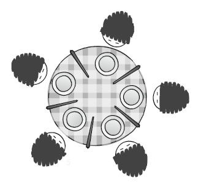

# "Philosophers" Project - 42 School

**This project simulates a scenario where chinese philosophers sit around a table. Each philosopher needs *two chopsticks to eat, but there’s only one available per philosopher*. To solve this, we must design rules so they can share chopsticks efficiently, allowing everyone to take turns eating, sleeping and thinking without starving. The challenge is to keep them alive as long as possible by avoiding deadlocks and ensuring fairness!**

- **Subject:** [English](./subject/en.subject.pdf) / [Spanish](./subject/es.subject.pdf)
- **Location:** 42 School Barcelona
- **Validation:** March 2025

 \
*If all philosophers grab a chopstick at the same time, no one gets a second one, causing a standstill. The solution? Smart rules (like taking turns or prioritizing utensils) to keep everyone fed.*

## Key Features

- **Concurrency Management:** Implement a solution to handle multiple threads or processes representing the philosophers.
- **Resource Allocation:** Manage the allocation of shared resources (chopsticks) to avoid deadlocks.
- **Synchronization:** Ensure that philosophers can eat and think without causing race conditions or starvation.

## Usage

**Run the program with the following command:**
```bash
./philo philosophers time_to_die time_to_eat time_to_sleep [meals_per_philosopher]
```
**Params:**
- `philosophers`: The number of philosophers (and also the number of chopsticks).
- `time_to_die` (in milliseconds): If a philosopher didn’t start eating *time_to_die* milliseconds since the beginning of their last meal or the beginning of the simulation, they die.
- `time_to_eat` (in milliseconds): The time it takes for a philosopher to eat. During that time, they will need to hold two chopsticks.
- `time_to_sleep` (in milliseconds): The time a philosopher will spend sleeping. 
- `meals_per_philosopher` (optional argument): The number of meals per philosopher before the simulation stops. If not specified, the simulation stops when a philosopher dies. 

**Example:**
```
./philo 5 800 200 200 7
```
This command will start a simulation with 5 philosophers, where each philosopher must eat 7 times before the program ends.

## Constraints

### Rules
- No global variable allowed
- Any state change of a philosopher must be logged in `stdout` as follows:
	- `timestamp_in_ms X has taken a fork`
	- `timestamp_in_ms X is eating`
	- `timestamp_in_ms X is sleeping`
	- `timestamp_in_ms X is thinking`
	- `timestamp_in_ms X died`
- Each philosopher should be a thread.
- No data races: Use mutexes to protect ustensils' state (prevent duplication).
- There is one fork between each pair of philosophers. If there is only one philosopher, there should be only one fork on the table.

### Allowed functions

**Threading:**
- `pthread_create`: Creates a new thread executing a specified function.
- `pthread_detach`: Marks a thread to release resources automatically after termination.
- `pthread_join`: Waits for a thread to terminate and cleans up its resources.
- `pthread_mutex_init`: Initializes a mutex with optional attributes.
- `pthread_mutex_destroy`: Destroys a mutex, freeing its resources.
- `pthread_mutex_lock`: Locks a mutex, blocking if already locked.
- `pthread_mutex_unlock`: Unlocks a mutex, allowing other threads to lock it.

**Misc.**
- `memset`
- `printf`
- `malloc`
- `free`
- `write`
- `usleep`
- `gettimeofday` 
