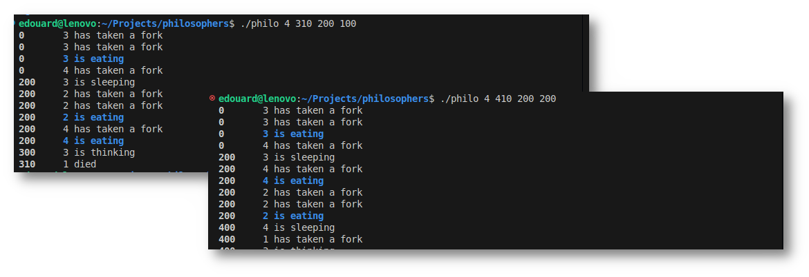
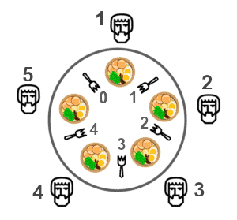
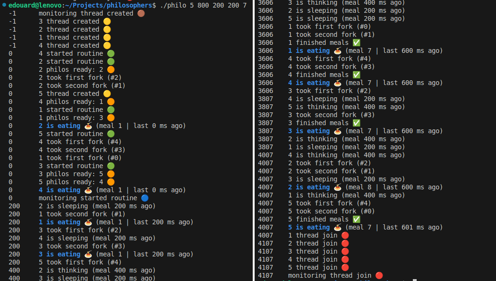
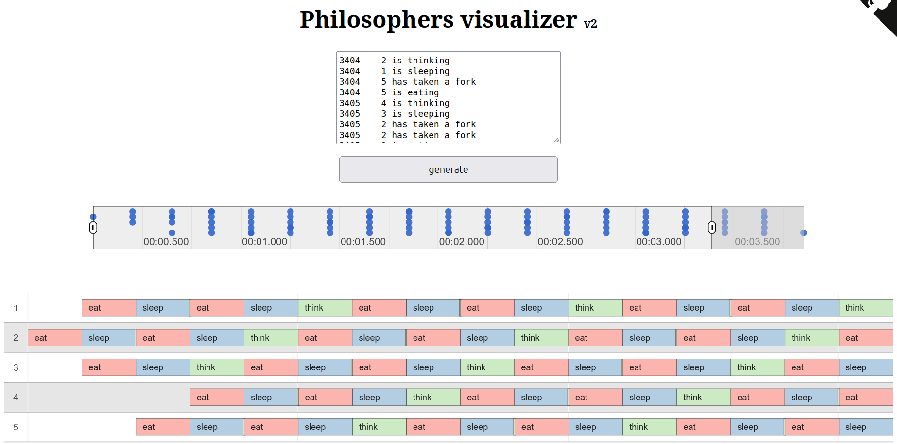

# "Philosophers" Project - 42 School



**Several philosophers are gathered around a table to think and share a plate of spaghetti. However, the waiter has only provided one fork for each guest. To continue thinking and stay alive, each philosopher must eat regularly. But they can only serve themselves the spaghetti from the central plate using two forks. Our brave philosophers will need to cooperate to share the forks equitably, ensuring that none of them starve for as long as possible.**

- **Subject:** [English](./subject/en.subject.pdf) / [Spanish](./subject/es.subject.pdf)
- **Location:** 42 School Barcelona
- **Validation:** March 2025

 \
*If all philosophers grab a chopstick at the same time, no one gets a second one, causing a standstill. The solution? Smart rules (like taking turns or prioritizing utensils) to keep everyone fed.*

## Key concepts

The "Dining Philosophers Problem" is a classic in mathematics, which, when applied to computer science, requires:
- the use of `threads` (each representing a philosopher)
- and the sharing of limited resources (the forks) via `mutexes` or `semaphores`.
Other key concepts are:
- avoiding `data races` and `deadlocks`.

## Usage

**Compile with:**
```
$ make
```

**Then run the program:**
```bash
$ ./philo philosophers time_to_die time_to_eat time_to_sleep [meals_per_philosopher]
```
Params:
- `philosophers`: The number of philosophers (and also the number of chopsticks).
- `time_to_die` (in milliseconds): If a philosopher didn’t start eating *time_to_die* milliseconds since the beginning of their last meal or the beginning of the simulation, they die.
- `time_to_eat` (in milliseconds): The time it takes for a philosopher to eat. During that time, they will need to hold two chopsticks.
- `time_to_sleep` (in milliseconds): The time a philosopher will spend sleeping.
- `meals_per_philosopher` (optional argument): The number of meals per philosopher before the simulation stops. If not specified, the simulation stops when a philosopher dies.

Example:
```
$ ./philo 5 800 200 200 7
```
This command will start a simulation with 5 philosophers, where each philosopher must eat 7 times before the program ends.

### Stress-test

To test the program when the CPU is a fully-loaded, use `stress`:
```
$ stress --cpu $(nproc) --timeout 60s
$ ./philo 5 800 200 200 7
```

### Valgrind test

Please note that signals handling (eg. SIGINT) is not asked for this project.
```
$ valgrind --tool=helgrind ./philo 2 310 200 400
```

### Run in DEBUG mode

The debug mode display mode informations about the diner. To use it, simply set `DEBUG_MODE` to `1` in `inc/philo.h`:
```
# define DEBUG_MODE 0 // -> Set to 1
```
Save the file and recompile the program with `$ make`.



### Visualize the log

Access the visualizer for the Dining Philosophers problem [here](https://nafuka11.github.io/philosophers-visualizer-v2/).



## Subject recap

### Dining rules
- One or more philosophers sit at a round table. There is a large bowl of spaghetti in the middle of the table.
- The philosophers alternatively eat, think, or sleep. *They can do only one of these actions at once.*
- There is one fork between each pair of philosophers. If there is only one philosopher, there should be only one fork on the table.
- A philosopher takes his right and left forks to eat, one in each hand.
- When a philosopher has finished eating, he puts his forks back on the table and start sleeping. Once awake, he starts thinking.
- The simulation stops when a philosopher dies of starvation (not eating for too long).
- Philosophers don’t know if another philosopher is about to die.

### Constraints
- No global variable allowed
- Any state change of a philosopher must be logged in `stdout`
- Each philosopher should be a thread.
- No data races: Use mutexes to protect ustensils' state (prevent duplication).


### Allowed functions

**Threading:**
- `pthread_create`: Creates a new thread executing a specified function.
- `pthread_detach`: Marks a thread to release resources automatically after termination.
- `pthread_join`: Waits for a thread to terminate and cleans up its resources.
- `pthread_mutex_init`: Initializes a mutex with optional attributes.
- `pthread_mutex_destroy`: Destroys a mutex, freeing its resources.
- `pthread_mutex_lock`: Locks a mutex, blocking if already locked.
- `pthread_mutex_unlock`: Unlocks a mutex, allowing other threads to lock it.

**Misc.:**

`memset`, `printf`, `malloc`, `free`, `write`, `usleep`, `gettimeofday`
